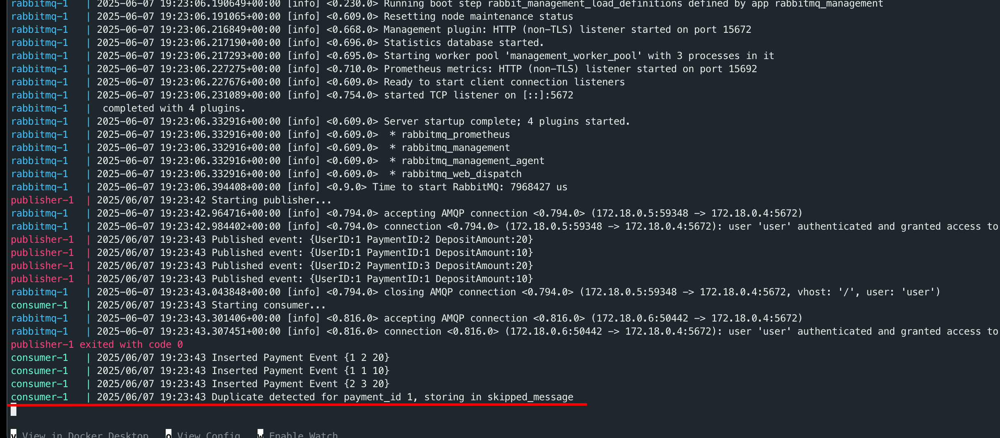
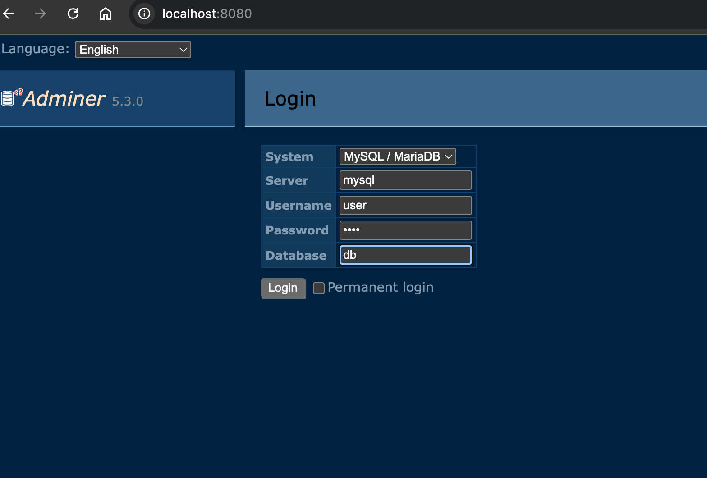
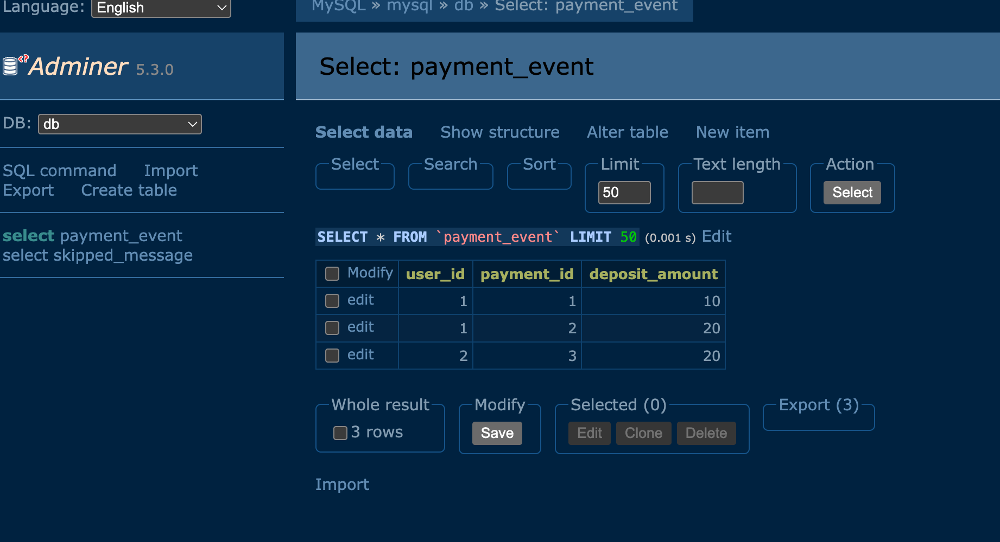
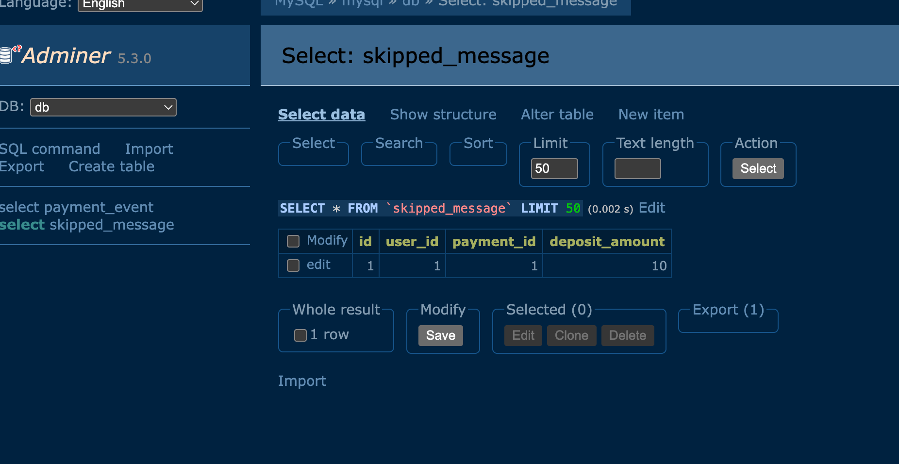

## RabbitMQ - MySQL Publisher & Consumer in Go

This project demonstrates a basic architecture using `Go`, `RabbitMQ`, and `MySQL` to publish and consume data.

### Overview

• The publisher sends `payment_events (user_id, payment_id, deposit_amount)` to a `RabbitMQ` queue.

• The consumer listens to that queue, consumes the messages, and stores them into a `MySQL` database.

• Duplicate `payment_id` entries are handled gracefully: if a duplicate primary key error occurs, the message is saved in a separate `skipped_message` table.

• `RabbitMQ` and `MySQL` are orchestrated via `Docker Compose`.



### How to run

1. Clone this repository:

```sh
git clone  git@github.com:yunica/go-rabbitmq-sync.git
cd go-rabbitmq-sync
```

2. Build and start the services:

```sh
docker compose up --build
```

This command will:

• Start `MySQL` and initialize the database with tables.

• Start `RabbitMQ` with management UI enabled.

• Build `Go` and run the services.

### Access RabbitMQ UI

Visit `http://localhost:15672`
Login with the credentials specified in `.env-rabbitmq`.

### Access MySQL

Visit `http://localhost:8080`
Login with the credentials specified in `.env-mysql`.

- login
  

- payment_event table
  

- skipped_message table
  
